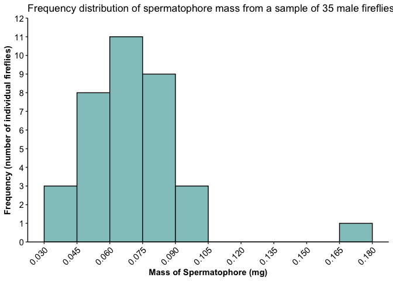
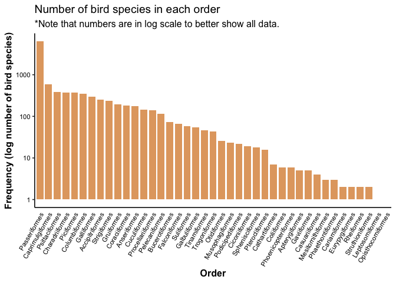

Lab 3 Report
================
Amaya Jerdee
2021-02-08

Instructions for this lab report can be found on [Your assignment
section of Lab Assignment 3 Introduction to
ggplot2](https://biol275-msum.github.io/introduction-to-ggplot2.html#your-assignment)
on the lab website.

# Fireflies

> A. Insert an R code chunk and create a graph depicting the frequency
> distribution of the 35 mass measurements. It should have legible text
> and appropriate axis labels.

## Load Packages

``` r
library(tidyverse)
```

    ## ── Attaching packages ─────────────────────────────────────── tidyverse 1.3.0 ──

    ## ✓ ggplot2 3.3.3     ✓ purrr   0.3.4
    ## ✓ tibble  3.0.5     ✓ dplyr   1.0.3
    ## ✓ tidyr   1.1.2     ✓ stringr 1.4.0
    ## ✓ readr   1.4.0     ✓ forcats 0.5.0

    ## ── Conflicts ────────────────────────────────────────── tidyverse_conflicts() ──
    ## x dplyr::filter() masks stats::filter()
    ## x dplyr::lag()    masks stats::lag()

## Load and Read Firefly Data

``` r
fireflies_data <- read_csv("https://whitlockschluter.zoology.ubc.ca/wp-content/data/chapter02/chap02q19FireflySpermatophoreMass.csv") 
```

    ## 
    ## ── Column specification ────────────────────────────────────────────────────────
    ## cols(
    ##   spermatophoreMass = col_double()
    ## )

``` r
fireflies_data
```

    ## # A tibble: 35 x 1
    ##    spermatophoreMass
    ##                <dbl>
    ##  1             0.047
    ##  2             0.037
    ##  3             0.041
    ##  4             0.045
    ##  5             0.039
    ##  6             0.064
    ##  7             0.064
    ##  8             0.065
    ##  9             0.079
    ## 10             0.07 
    ## # … with 25 more rows

## Histogram of firefly spermatophore mass measurements

``` r
       ggplot(data = fireflies_data) +
  geom_histogram(mapping = aes(x = spermatophoreMass), binwidth = 0.015, 
                 boundary = 0, closed = "left", fill = "#92C7C7", 
                 color = "black") +
  labs(x = "Mass of Spermatophore (mg)", y = "Frequency (number of individual fireflies)", 
       title = "Frequency distribution of spermatophore mass from a sample of 35 male fireflies") +
  scale_y_continuous(breaks = seq(0, 12, 1), limits = c(0, 12), 
                     expand = expansion(mult = 0)) +
  scale_x_continuous(breaks = seq(0.03, 0.18, 0.015), limits = c(0.03, 0.18)) +
  theme_classic() +
  theme(
    axis.title = element_text(face = "bold"),
    axis.text = element_text(color = "black", size = rel(1)),
    axis.text.x = element_text(angle = 45, hjust = 1)
    )                                                                                       
```

<!-- -->

## Questions about firefly data

> B. What type of graph did you choose in part (A)? Why?

*I created a histogram because we were given a numerical variable data
set. The reason for this choice was because bar graphs show frequency
distribution of categorical data better and we were given numerical data
frequencies, which is better represented by histograms*

> C. Describe the shape of the frequency distribution. What are its main
> features?

*Unimodal skewing right is the shape visable on the histogram. The one
main bell-shaped clump of data between 0.03mg and 0.10mg.*

> D. What term would be used to describe the largest measurement in the
> frequency distribution? You can refer to the lecture slides, your
> notes, or the textbook.

*The Mode.*

# Bird orders

I read the data using the code provided by the instructor. The dataset
is from the auk package and was originally named ebird\_taxonomy. I
converted it to a tibble, removed non-species taxa, and named the new
dataset birds.

## Load package, convert/filter bird data

``` r
library(auk)                          # load the auk package
```

    ## auk 0.4.2 is designed for EBD files downloaded after 2019-08-15. 
    ## No EBD data directory set, see ?auk_set_ebd_path to set EBD_PATH 
    ## eBird taxonomy version:  2019

``` r
birds <- ebird_taxonomy %>%           # start with the ebird_taxonomy data
as_tibble() %>%                     # tibbles print better in the console
filter(category == "species")       # remove non-species taxa
```

## Read bird data

\`\`{r} birds distinct(birds, scientific\_name) count(birds, order)

```` 
                                                                                                                         
## Questions about Bird Data 
                                                                                                                         
> E. How many bird species are in the new birds dataset? How did you find out?
*In the new birds dataset there are 10,271 bird species. This was found by  
There are 10,721 bird species in the dataset. I found this by creating a table of distinct scientific names and there were a total of 10,721 rows, telling me that that is how many bird species there are.*
                                                                                                                           
> H. How many orders are there? You can get this right by counting on the graph, but you will only get full points if you use some code to figure it out.
*There are 41 orders. This was found by creating a contingency table*
                                                                                                                           
## Bird Order Bar Graph
                                                                                                                           
>F. Insert an R code chunk and create a graph depicting the distribution of orders in the birds dataset. Sort the orders with the most frequent on the left. It should have legible text and appropriate axis labels.


```r
ggplot(data = birds) +
  geom_bar(mapping = aes(x = fct_infreq(order)), fill = "#E2A76F", 
           width = .8) +
  labs(x = "Order", y = "Frequency (log number of bird species)", 
       title = "Number of bird species in each order", 
       subtitle = "*Note that numbers are in log scale to better show all data.") +
  scale_y_log10() +
  theme_classic(base_size = 12) +
  theme(
    axis.title = element_text(face = "bold"),
    axis.text = element_text(color = "black", size = rel(.7)),
    axis.text.x = element_text(angle = 60, hjust = 1),
    axis.ticks.x = element_blank()
  )                                                                                                                     
````

<!-- -->

> G. What kind of graph did you create? Why? *We are representing a
> categorical variable, which is best shown on a bar graph.*

\_\_\_

## Links to peer review

I reviewed Brett Vetter’s lab report at this
Url:<https://github.com/BIOL275-MSUM/lab-3-intro-to-ggplot-brettvetter>
Brett Vetter reviewed my lab report at this Url:
<https://github.com/BIOL275-MSUM/lab-3-intro-to-ggplot-ajerdee>

## Session Info

Here is my session information:

``` r
sessioninfo::session_info()
```

    ## ─ Session info ───────────────────────────────────────────────────────────────
    ##  setting  value                       
    ##  version  R version 4.0.3 (2020-10-10)
    ##  os       macOS Sierra 10.12.6        
    ##  system   x86_64, darwin17.0          
    ##  ui       X11                         
    ##  language (EN)                        
    ##  collate  en_US.UTF-8                 
    ##  ctype    en_US.UTF-8                 
    ##  tz       America/Chicago             
    ##  date     2021-02-08                  
    ## 
    ## ─ Packages ───────────────────────────────────────────────────────────────────
    ##  package     * version date       lib source        
    ##  assertthat    0.2.1   2019-03-21 [1] CRAN (R 4.0.2)
    ##  auk         * 0.4.3   2020-11-23 [1] CRAN (R 4.0.2)
    ##  backports     1.2.1   2020-12-09 [1] CRAN (R 4.0.2)
    ##  broom         0.7.3   2020-12-16 [1] CRAN (R 4.0.2)
    ##  cellranger    1.1.0   2016-07-27 [1] CRAN (R 4.0.2)
    ##  cli           2.2.0   2020-11-20 [1] CRAN (R 4.0.2)
    ##  colorspace    2.0-0   2020-11-11 [1] CRAN (R 4.0.2)
    ##  crayon        1.3.4   2017-09-16 [1] CRAN (R 4.0.2)
    ##  curl          4.3     2019-12-02 [1] CRAN (R 4.0.1)
    ##  DBI           1.1.1   2021-01-15 [1] CRAN (R 4.0.2)
    ##  dbplyr        2.0.0   2020-11-03 [1] CRAN (R 4.0.2)
    ##  digest        0.6.27  2020-10-24 [1] CRAN (R 4.0.2)
    ##  dplyr       * 1.0.3   2021-01-15 [1] CRAN (R 4.0.2)
    ##  ellipsis      0.3.1   2020-05-15 [1] CRAN (R 4.0.2)
    ##  evaluate      0.14    2019-05-28 [1] CRAN (R 4.0.1)
    ##  fansi         0.4.1   2020-01-08 [1] CRAN (R 4.0.2)
    ##  farver        2.0.3   2020-01-16 [1] CRAN (R 4.0.2)
    ##  forcats     * 0.5.0   2020-03-01 [1] CRAN (R 4.0.2)
    ##  fs            1.5.0   2020-07-31 [1] CRAN (R 4.0.2)
    ##  generics      0.1.0   2020-10-31 [1] CRAN (R 4.0.2)
    ##  ggplot2     * 3.3.3   2020-12-30 [1] CRAN (R 4.0.2)
    ##  glue          1.4.2   2020-08-27 [1] CRAN (R 4.0.2)
    ##  gtable        0.3.0   2019-03-25 [1] CRAN (R 4.0.2)
    ##  haven         2.3.1   2020-06-01 [1] CRAN (R 4.0.2)
    ##  hms           1.0.0   2021-01-13 [1] CRAN (R 4.0.2)
    ##  htmltools     0.5.0   2020-06-16 [1] CRAN (R 4.0.2)
    ##  httr          1.4.2   2020-07-20 [1] CRAN (R 4.0.2)
    ##  jsonlite      1.7.2   2020-12-09 [1] CRAN (R 4.0.2)
    ##  knitr         1.30    2020-09-22 [1] CRAN (R 4.0.2)
    ##  lifecycle     0.2.0   2020-03-06 [1] CRAN (R 4.0.2)
    ##  lubridate     1.7.9.2 2020-11-13 [1] CRAN (R 4.0.2)
    ##  magrittr      2.0.1   2020-11-17 [1] CRAN (R 4.0.2)
    ##  modelr        0.1.8   2020-05-19 [1] CRAN (R 4.0.2)
    ##  munsell       0.5.0   2018-06-12 [1] CRAN (R 4.0.2)
    ##  pillar        1.4.7   2020-11-20 [1] CRAN (R 4.0.2)
    ##  pkgconfig     2.0.3   2019-09-22 [1] CRAN (R 4.0.2)
    ##  purrr       * 0.3.4   2020-04-17 [1] CRAN (R 4.0.2)
    ##  R6            2.5.0   2020-10-28 [1] CRAN (R 4.0.2)
    ##  Rcpp          1.0.5   2020-07-06 [1] CRAN (R 4.0.2)
    ##  readr       * 1.4.0   2020-10-05 [1] CRAN (R 4.0.2)
    ##  readxl        1.3.1   2019-03-13 [1] CRAN (R 4.0.2)
    ##  reprex        0.3.0   2019-05-16 [1] CRAN (R 4.0.2)
    ##  rlang         0.4.10  2020-12-30 [1] CRAN (R 4.0.2)
    ##  rmarkdown     2.6     2020-12-14 [1] CRAN (R 4.0.2)
    ##  rstudioapi    0.13    2020-11-12 [1] CRAN (R 4.0.2)
    ##  rvest         0.3.6   2020-07-25 [1] CRAN (R 4.0.2)
    ##  scales        1.1.1   2020-05-11 [1] CRAN (R 4.0.2)
    ##  sessioninfo   1.1.1   2018-11-05 [1] CRAN (R 4.0.2)
    ##  stringi       1.5.3   2020-09-09 [1] CRAN (R 4.0.2)
    ##  stringr     * 1.4.0   2019-02-10 [1] CRAN (R 4.0.2)
    ##  tibble      * 3.0.5   2021-01-15 [1] CRAN (R 4.0.2)
    ##  tidyr       * 1.1.2   2020-08-27 [1] CRAN (R 4.0.2)
    ##  tidyselect    1.1.0   2020-05-11 [1] CRAN (R 4.0.2)
    ##  tidyverse   * 1.3.0   2019-11-21 [1] CRAN (R 4.0.2)
    ##  utf8          1.1.4   2018-05-24 [1] CRAN (R 4.0.2)
    ##  vctrs         0.3.6   2020-12-17 [1] CRAN (R 4.0.2)
    ##  withr         2.3.0   2020-09-22 [1] CRAN (R 4.0.2)
    ##  xfun          0.20    2021-01-06 [1] CRAN (R 4.0.2)
    ##  xml2          1.3.2   2020-04-23 [1] CRAN (R 4.0.2)
    ##  yaml          2.2.1   2020-02-01 [1] CRAN (R 4.0.2)
    ## 
    ## [1] /Library/Frameworks/R.framework/Versions/4.0/Resources/library
